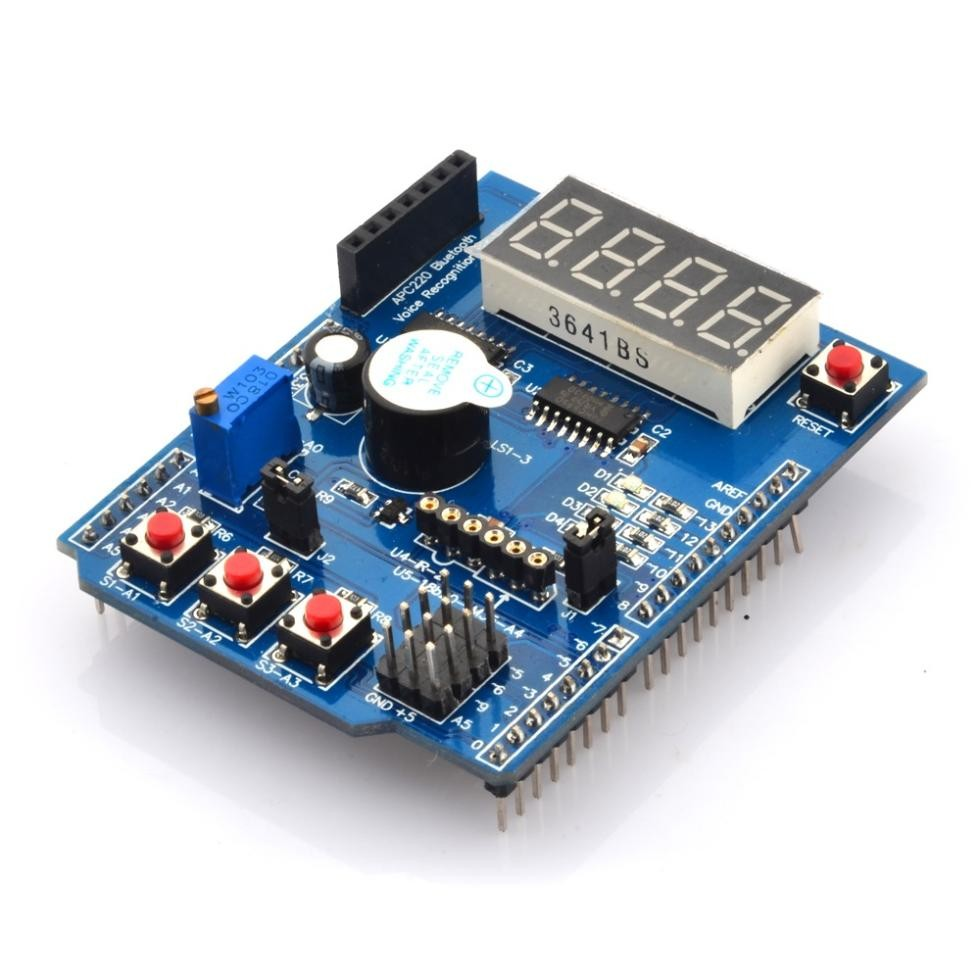

# Arduino Knight Rider

V tomto projektu jsme vytvořili kód pro Arduino, který bliká LED diodami podle vzoru z televizního seriálu Knight Rider. Kód je napsán v jazyce C++.

Využili jsme funkce `milis()` pro časování a asynchrónní blikání LED diodami.

Díky tomu můžeme kdykoliv změnit způsob blikání.

## Použité součástky

- Arduino Uno
- Výukový [multi shield](https://dratek.cz/arduino/1203-eses-vyukovy-multi-shield-pro-arduino-uno.html) pro Arduino UNO

## Instalace

V projektu používáme PlatformIO pro správu kódu a nahrávání do Arduina.

1. Nainstalujte si [PlatformIO](https://platformio.org/) do VSCode
2. Naklonujte si tento repozitář
3. Otevřete projekt v PlatformIO
4. Nahrajte kód do Arduina
5. Užívejte

## Licence

[WTFPL](wtfpl.net) – Do What the Fuck You Want to Public License
